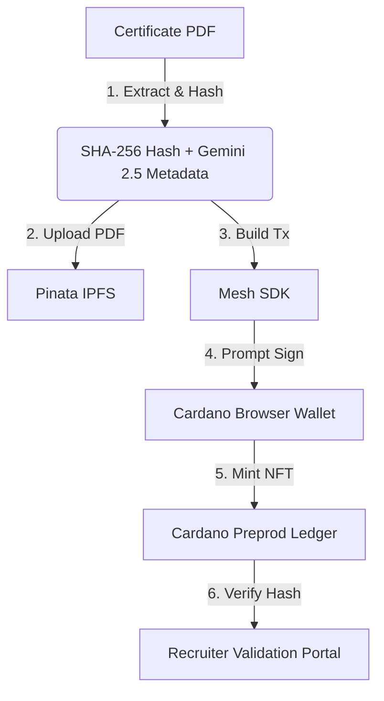
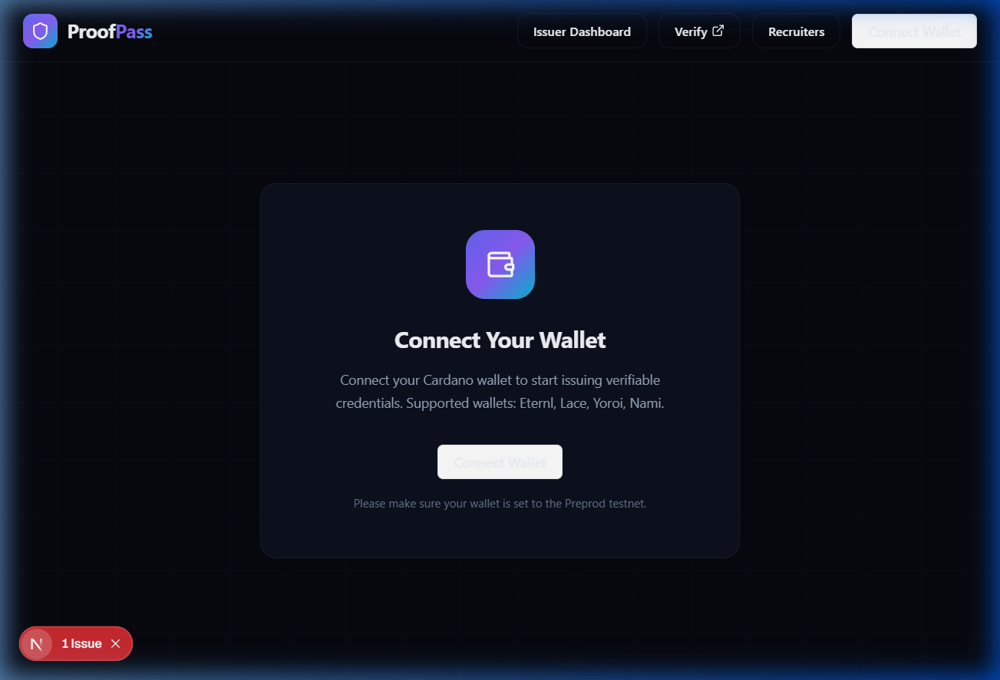
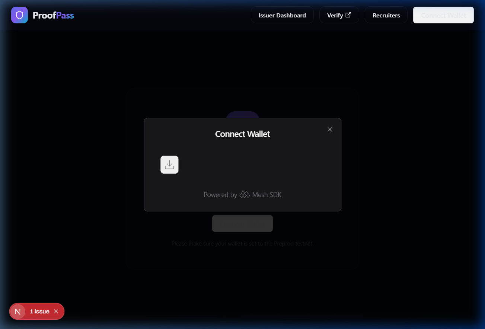

# Proofpass — Cardano Blockchain Implementation (For Judges)

This guide provides judges with a detailed technical explanation of how **Proofpass** utilizes the Cardano blockchain to secure and verify digital credentials.

---

## 🏛️ Why Cardano?

Standard digital certificates (PDFs, paper, or database records) are highly vulnerable to manipulation and forgery. If an issuing institute closes or deletes its database, students lose their credentials. 

By anchoring credentials on the **Cardano blockchain**, Proofpass ensures that:
1. **Permanence**: Once minted, the certificate details live forever on a decentralized ledger.
2. **Tamper-Proof Verification**: The relationship between the recipient's name, the skills certified, and the original document's cryptographic hash cannot be changed.
3. **Decentralized Trust**: Recruiters can verify credentials instantly without trusting a centralized server.

---

## ⚙️ Technical Architecture



### 1. Mesh SDK & Wallet Integration
We use **Mesh SDK** to construct transactions in the browser and interact with Cardano browser extension wallets (like Eternl, Lace, Yoroi, Nami) using the standard **CIP-30 (Cardano Wallet Web Bridge)**.

* **Code Reference**: [mint-credential.ts](src/lib/cardano/mint-credential.ts#L28-L85)
* **Transaction Construction**:
  We instantiate a new transaction session using the connected wallet as the initiator:
  ```typescript
  const tx = new Transaction({ initiator: wallet });
  ```

### 2. CIP-25 NFT Metadata Standard
Every credential is minted as a unique **Cardano Native Asset (NFT)**. The on-chain metadata follows the standard **CIP-25 metadata specification** under transaction metadata label `721`:

```json
{
  "721": {
    "POLICY_ID": {
      "ASSET_NAME_HEX": {
        "name": "Proofpass: John Doe — Cardano Development",
        "description": "Verified credential issued by Government Institute of Electronics",
        "image": "ipfs://bafybeic...",
        "student": "John Doe",
        "issuer": "Government Institute of Electronics",
        "course": "Advanced Blockchain Development on Cardano",
        "certificateHash": "c74769b89245045ec4636232599ef17a1047c0a6057ecb2a92b887f26b5ec187",
        "issuedAt": "2026-07-10",
        "skills": "Haskell, Plutus, Smart Contracts, Cardano",
        "verificationUrl": "http://localhost:3000/verify/CDA59PA",
        "mediaType": "application/pdf"
      }
    }
  }
}
```

### 3. Native Policy Script & Minting
To secure the minting process, we generate a **ForgeScript native script policy** which ensures only the issuing organization's wallet key is authorized to sign and mint tokens under the policy:

```typescript
// Define policy script requiring the issuer's wallet signature
const forgingScript = ForgeScript.withOneSignature(issuerAddress);

// Append minting instructions to transaction
tx.mintAsset(forgingScript, {
  assetName: assetName, // Unique Hex-encoded shortcode (e.g. 43444135395041)
  assetMetadata: assetMetadata
});
```

To satisfy Cardano's UTXO storage constraints, we send the newly minted NFT alongside a minimum amount of ADA (typically ~2.0 ADA) to the recipient's or issuer's wallet address:

```typescript
tx.sendAssets({
  address: issuerAddress,
  assets: [{
    unit: `${policyId}${assetName}`,
    quantity: "1"
  }]
});
```

---

## 🛡️ Verification Pipeline & Forgery Checks

When a recruiter or user uploads a certificate to verify it, Proofpass executes two verification stages:

### Stage 1: Document Tamper-Check (Cryptographic Hash Matching)
1. The app computes the **SHA-256 hash** of the uploaded PDF file.
2. The hash is compared against the `certificateHash` field stored directly on the Cardano ledger (read via Blockfrost provider).
3. **Outcome**: If a student attempts to modify their name or credentials in a PDF editor, the document's SHA-256 hash changes completely. The verification screen will flag this instantly as **Tampered / Unverified**.

### Stage 2: AI Anomaly Audits
Using **Google Gemini 2.5 Flash**, the system audits the document's structure, verifying that:
- Issue dates are logically consistent (i.e. not set in the future).
- Issuing names, signatures, and stamps are present.
- Skills listed are contextually accurate to the curriculum.

---

## 📂 Visual Walkthrough Screenshots

### Issuer Connects Wallet & Views Dashboard


### CIP-30 Wallet Authorization Modal

